<div align="center">
  
  <h2 style="margin-top: 5px; border-bottom: none;">Mockly: AI Interview Coach</h2>
</div>

[](https://deepwiki.com/wshngwell/Mockly-AI-Interview-Coach)

Mockly is an AI-powered Android application designed to help you prepare for and ace your technical interviews. Built with Kotlin and Jetpack Compose, the app provides a realistic simulation of an interview session where you can practice answering questions for various IT roles and experience levels. Get instant, intelligent feedback on your voice responses and track your progress.

This project is built using modern Android development practices and libraries.

## 📱 Screenshots
<p align="center"> 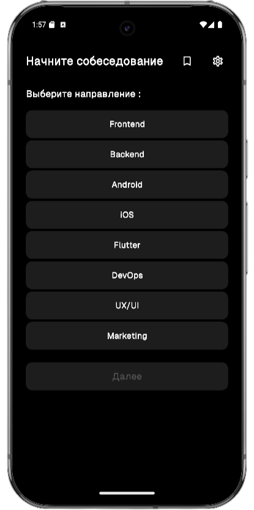 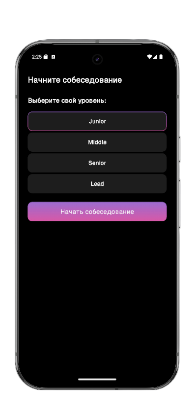
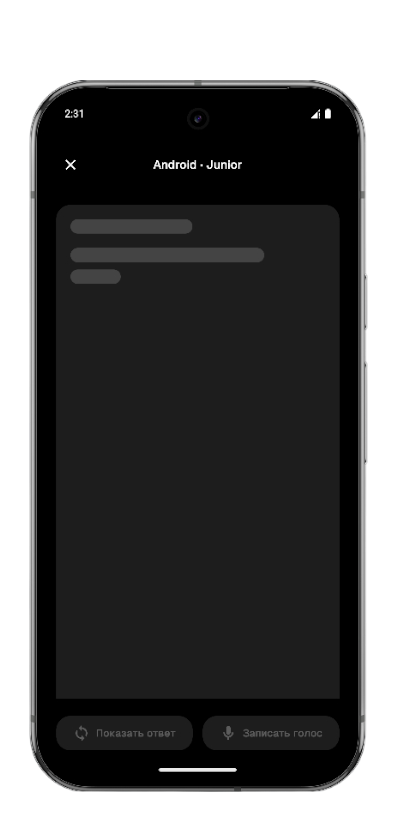 
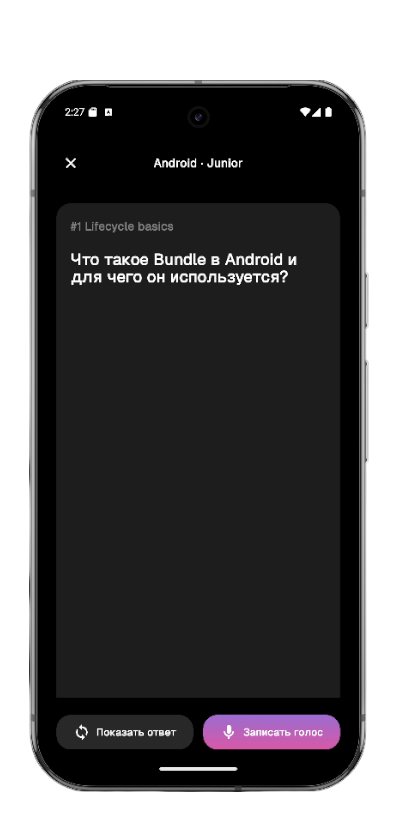 
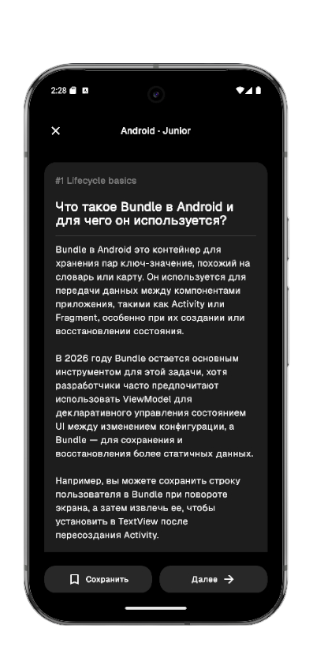 
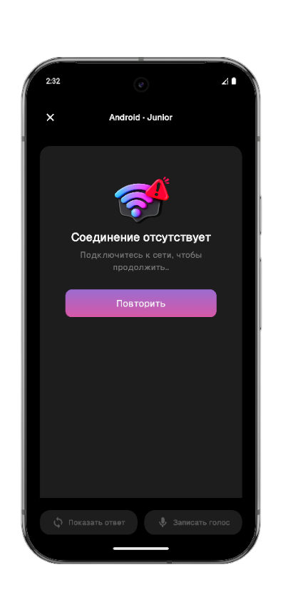 
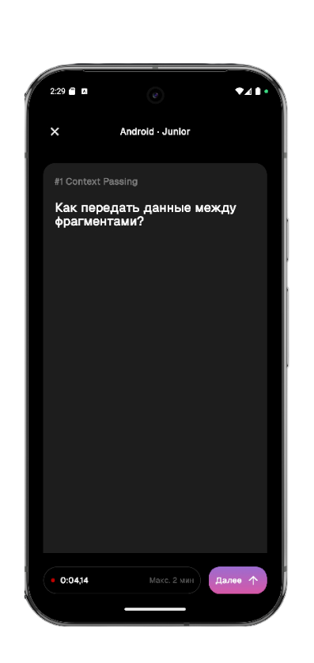 
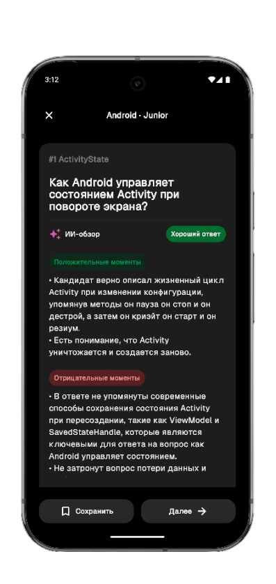 
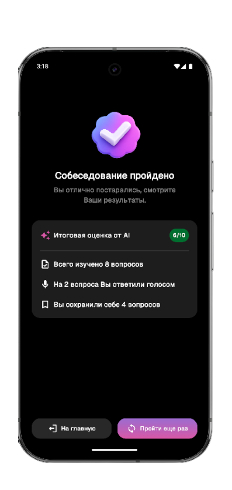 
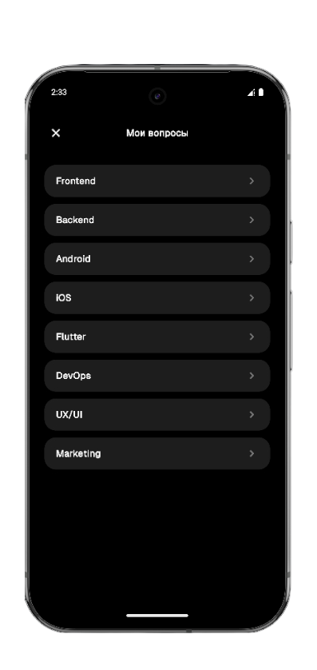 
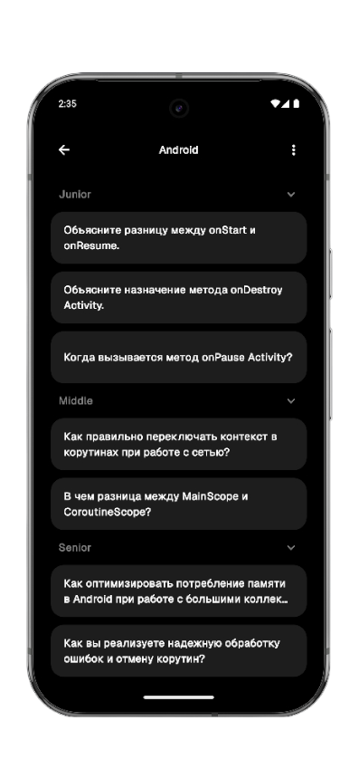 
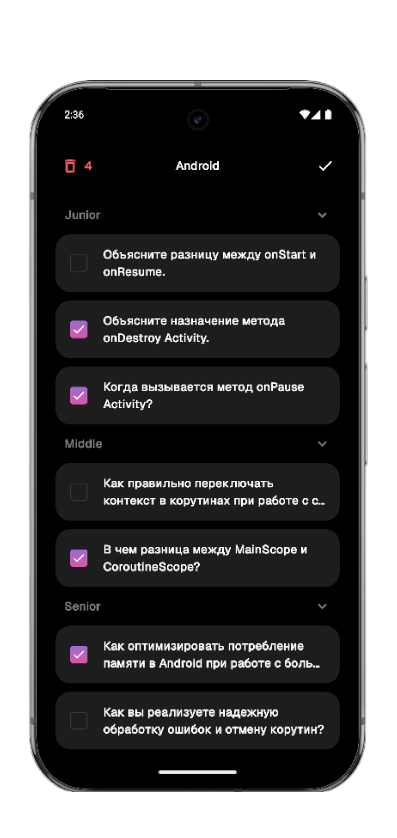 
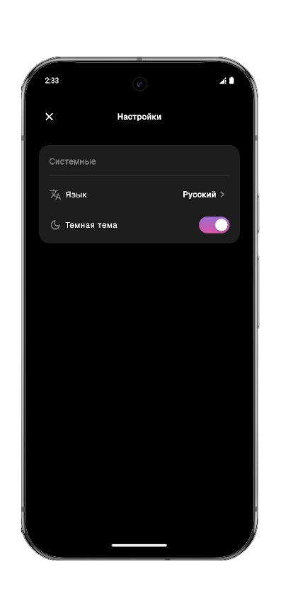 </p>

## ✨ Features

*   **AI-Powered Mock Interviews:** Engage in realistic interview sessions with questions dynamically generated by an AI tailored to your chosen field and grade.
*   **Customizable Practice:** Select your IT specialization (e.g., Android, Backend, Frontend) and experience level (Junior, Middle, Senior, Lead) to focus your practice.
*   **Voice-to-Text Answering:** Respond to questions by speaking naturally. The app records, transcribes your audio, and submits it for analysis.
*   **Instant AI Feedback:** Receive a detailed analysis of your answer, including a 1-10 rating, a summary of strengths, and constructive points for improvement.
*   **Model Answers:** After attempting a question, you can view a well-structured, AI-generated answer to compare with your own.
*   **Save & Review:** Bookmark challenging questions to a personal library. Saved questions are organized by category and grade for easy review.
*   **Performance Summary:** At the end of each session, view a results screen summarizing your performance, including your average score and the number of questions answered.
*   **Personalization:** Customize your experience with a choice of Light/Dark themes and support for both English and Russian languages.

## 🛠 Technical Stack & Architecture

<p align="left">
  
  
  
  
  
</p>

*   **Core:** Kotlin, Coroutines + Flow
*   **UI:** Jetpack Compose
*   **Architecture:** Clean Architecture principles with presentation (MVI), domain, and data layers.
*   **Dependency Injection:** Koin
*   **Networking:** Retrofit & OkHttp for consuming the OpenRouter API.
*   **Database:** Room for local storage of favorite questions.
*   **Navigation:** Compose Destinations for type-safe navigation between screens.
*   **AI Integration:** Leverages the OpenRouter API to interact with Google's Gemini models for question generation, transcription, and feedback.

## 💡How It Works?

1.  **Select Direction:** Choose your professional field (e.g., Frontend, Android, DevOps).
2.  **Select Grade:** Specify your experience level (Junior to Lead).
3.  **Answer Question:** The app will present an AI-generated question. You can either answer it using your voice or view the correct answer.
4.  **Record & Submit:** To answer, press the record button. The app will capture your voice for up to two minutes and transcribe it to text.
5.  **Receive Feedback:** The AI analyzes your transcribed answer and provides a score along with a breakdown of what you did well and what you can improve.
6.  **Next Steps:** You can save the question for later, view the model answer, or move on to the next question.
7.  **End Session:** Exit the interview at any time to see your final results.

## 🚀 Setup

To build and run the project locally, follow these steps:

1.  Clone the repository:
    ```bash
    git clone https://github.com/wshngwell/mockly-ai-interview-coach.git
    ```
2.  Navigate to the project directory.

3.  Create a `local.properties` file in the root directory of the project.

4.  Add your OpenRouter API key to the `local.properties` file:
    ```properties
    apikey="YOUR_OPENROUTER_API_KEY"
    ```
5.  Open the project in Android Studio and sync the Gradle files.

6.  Build and run the application on an Android device or emulator.